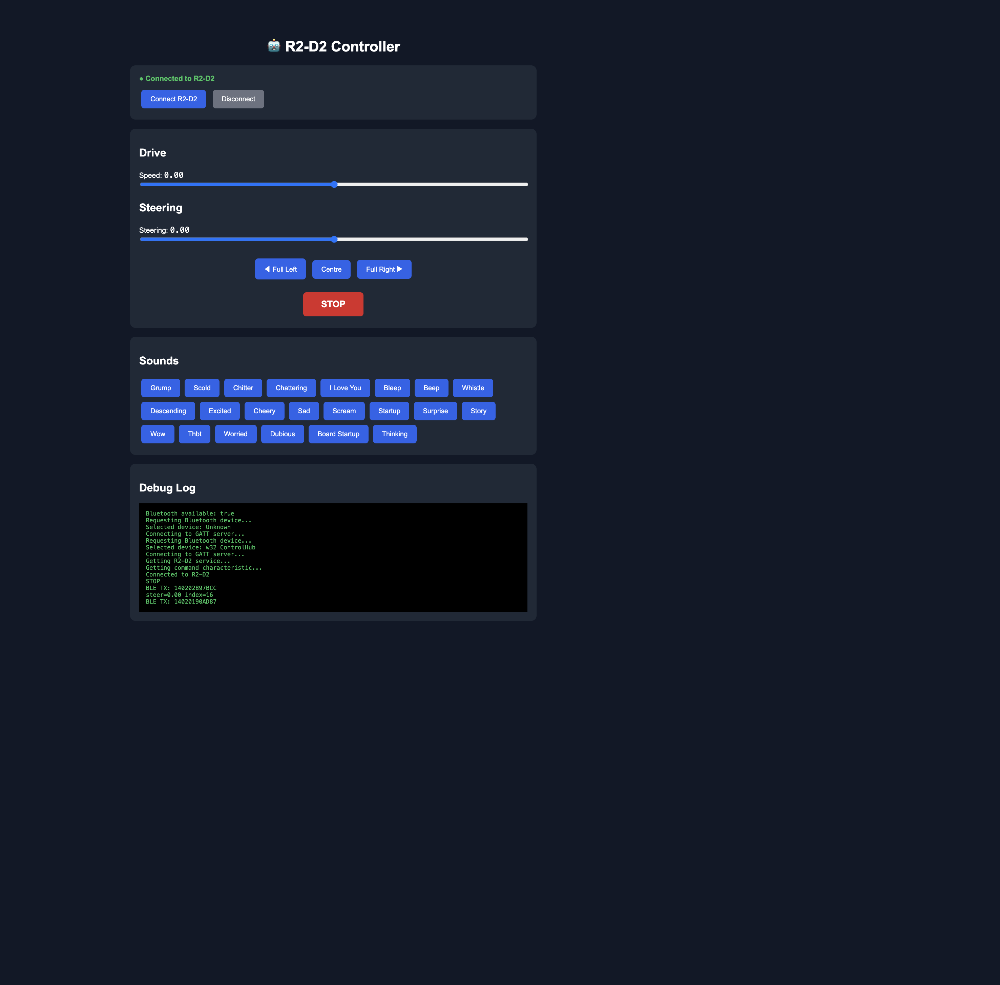

# R2-D2 Bluetooth Controller

A three-interface system for controlling a real R2-D2 robot toy over Bluetooth Low Energy (BLE):

| Interface | File | How you control it |
|---|---|---|
| **Web Controller** | `R2D2.html` | Buttons, sliders and sound board in the browser |
| **Agentic MCP** | `R2D2-mcp.py` | AI agents (Copilot, Claude, Cursor) call tools to drive and play sounds |
| **The Force** | `the-force.html` | Webcam-based facial & hand gesture control — open hand to drive, tilt to steer, thumbs up or open mouth for sounds |

---

## Project Structure

```
R2D2/
├── R2D2.html          # Browser-based BLE controller (Web Bluetooth API)
├── the-force.html     # Gesture controller — face tilt steers, thumbs up plays sounds
├── R2D2-mcp.py        # Python MCP server exposing R2D2 controls as AI tools
├── requirements.txt   # Python dependencies (bleak, mcp)
├── setup.sh           # One-shot environment setup + server launcher
├── screenshot.png     # UI screenshot used in this README
├── .vscode/
│   └── mcp.json       # VS Code MCP server config (auto-detected by Copilot)
└── README.md
```

---

## The Device — littleBits Star Wars Droid Inventor Kit

The **littleBits Star Wars Droid Inventor Kit** (Model `680-0011`), released in late 2017, is an award-winning STEM construction toy designed around snap-together magnetic blocks (Bits). Physically, it features a transparent plastic chassis revealing a modular electronic core, heavily relying on a central electronic block named the **w33 Control Hub** to process sensor input and command the droid's motors over Bluetooth Low Energy (BLE). [[1]](https://www.youtube.com/watch?v=hHYW4oW6jKs&t=141) [[2]](https://www.youtube.com/watch?v=TSpChbuqpdk&t=2) [[3]](https://help.sphero.com/sphero-support/inventor-kits-base-electronic-music-and-space-rover)

---

### Hardware Architecture

The internal electronics are driven by individual modular blocks linked together via magnetic, error-proof three-pin connectors carrying Power (VCC, ~5V converted from a 9V battery), Signal (Analog/PWM/Digital data), and Ground (GND). [[1]](https://www.youtube.com/watch?v=hHYW4oW6jKs&t=141)

```
[ Power Bit ] ──> [ w33 Control Hub ] ──> [ Wire/Splitter Bit ]
                         │                       │
                         ▼                       ▼
                [ Proximity Sensor ]       [ DC Motors / Servo ]
```

| Block | Role |
|---|---|
| **w33 Control Hub** | The brain — a BLE peripheral housing a Nordic Semiconductor nRF-series SoC that translates incoming wireless data into hardware output signals |
| **Proximity Sensor Bit** | Infrared (IR) reflection sensor providing real-time distance data for autonomous navigation [[4]](https://www.youtube.com/watch?v=xxQ2ypFgOVg&t=217) [[5]](https://www.bostontechmom.com/harness-force-littlebits-star-wars-droid-inventor-kit/) |
| **DC Motor Bits** | Geared rear-wheel motors driven by PWM voltage signals from the Control Hub [[6]](https://www.youtube.com/watch?v=xxQ2ypFgOVg&t=217) |
| **Servo Motor Bit** | Installed in the neck section for head rotation and positioning [[7]](https://www.youtube.com/watch?v=Gppwwbx2Tgw&t=336) |

---

### Official App Discontinuation

The original companion app featured over 22 in-app missions including Drive Mode (on-screen joysticks/tilt controls), Self-Nav Mode (autonomous obstacle avoidance via the IR sensor), and Force Mode (proximity-triggered steering). Following Sphero's acquisition of littleBits and the expiration of the Disney/Star Wars IP licence, **Sphero completely removed the companion apps from the iOS App Store and Google Play Store**. [[8]](https://www.reddit.com/r/littlebits/comments/ouvacj/littlebits_droid_inventor_kit_ios_app/) [[9]](https://mashable.com/article/star-wars-littlebits-droid-inventor-kit-force-friday) [[12]](https://www.techradar.com/reviews/littlebits-droid-inventor-kit)

Without the official app to issue BLE startup and initialisation commands, the w33 Control Hub sits in a standby state (flashing white status LED) and refuses to activate or route any signals to the attached motors. [[8]](https://www.reddit.com/r/littlebits/comments/ouvacj/littlebits_droid_inventor_kit_ios_app/) [[11]](https://help.sphero.com/sphero-support/ble-bit-connection-and-troubleshooting) This project exists to replace that lost functionality entirely.

---

### BLE Protocol & Reverse Engineering

Independent reverse-engineering (primarily [meetar's littlebits-r2d2-controls](https://github.com/meetar/littlebits-r2d2-controls) [[10]](https://github.com/meetar/littlebits-r2d2-controls) [[13]](https://github.com/meetar/littlebits-r2d2-controls)) has mapped how the Control Hub processes data packets.

**Connection & LED states** [[11]](https://help.sphero.com/sphero-support/ble-bit-connection-and-troubleshooting)

- When powered on the hub advertises as `w32 ControlHub` / `w33 Control Hub`
- Blinking white LED = advertising, ready to pair
- Solid green LED = successfully connected

**GATT structure**

The device uses a single custom write characteristic to receive all command arrays:

| | UUID |
|---|---|
| Service | `d9d9e9e0-aa4e-4797-8151-cb41cedaf2ad` |
| Characteristic | `d9d9e9e1-aa4e-4797-8151-cb41cedaf2ad` |

**Buffer throttling** [[13]](https://github.com/meetar/littlebits-r2d2-controls)

The w33 Control Hub's write buffer is notably fragile. Flooding the characteristic with unthrottled data causes buffer overflows and forced disconnects. A delay of **20–50 ms between sequential write commands** is required for smooth, reliable operation.

**Command maps** [[13]](https://github.com/meetar/littlebits-r2d2-controls)

| Command type | Frames | Format prefix |
|---|---|---|
| Drive (full reverse → full forward) | 62 | `14 02 02 ...` |
| Turn (hard left → hard right) | 33 | `14 02 01 ...` |
| Sound | 22 | `1E 01 ...` |

**Behaviour notes**

- R2-D2 only advertises BLE for **~30 seconds** after power-on — power-cycle if it doesn't appear in scans
- A **stop + straight frame** is sent immediately on connect (safety behaviour)
- If another device is already connected, R2-D2 won't advertise until that connection is released
- The droid has an **auto-sleep** timeout that drops the BLE link after inactivity

---

### References

| # | Source |
|---|---|
| [1] | [YouTube — Internal teardown](https://www.youtube.com/watch?v=hHYW4oW6jKs&t=141) |
| [2] | [YouTube — Unboxing](https://www.youtube.com/watch?v=TSpChbuqpdk&t=2) |
| [3] | [Sphero Support — Inventor Kits](https://help.sphero.com/sphero-support/inventor-kits-base-electronic-music-and-space-rover) |
| [4] | [YouTube — Proximity sensor demo](https://www.youtube.com/watch?v=xxQ2ypFgOVg&t=217) |
| [5] | [Boston Tech Mom — Force Mode](https://www.bostontechmom.com/harness-force-littlebits-star-wars-droid-inventor-kit/) |
| [6] | [YouTube — Motor analysis](https://www.youtube.com/watch?v=xxQ2ypFgOVg&t=217) |
| [7] | [YouTube — Servo/head](https://www.youtube.com/watch?v=Gppwwbx2Tgw&t=336) |
| [8] | [Reddit — App removal discussion](https://www.reddit.com/r/littlebits/comments/ouvacj/littlebits_droid_inventor_kit_ios_app/) |
| [9] | [Mashable — Force Friday review](https://mashable.com/article/star-wars-littlebits-droid-inventor-kit-force-friday) |
| [10] | [GitHub — meetar/littlebits-r2d2-controls](https://github.com/meetar/littlebits-r2d2-controls) |
| [11] | [Sphero Support — BLE troubleshooting](https://help.sphero.com/sphero-support/ble-bit-connection-and-troubleshooting) |
| [12] | [TechRadar — Kit review](https://www.techradar.com/reviews/littlebits-droid-inventor-kit) |
| [13] | [GitHub — meetar/littlebits-r2d2-controls (protocol details)](https://github.com/meetar/littlebits-r2d2-controls) |

---

## How It Works

Both interfaces communicate with R2-D2 over the same BLE service/characteristic:

| | Value |
|---|---|
| Service UUID | `d9d9e9e0-aa4e-4797-8151-cb41cedaf2ad` |
| Characteristic UUID | `d9d9e9e1-aa4e-4797-8151-cb41cedaf2ad` |

Commands are pre-encoded hex frames written to the GATT characteristic — the same protocol used by the official R2-D2 app.

---

## Interface 1 — Browser Controller (`R2D2.html`)

A standalone HTML file with no build step or dependencies. Open it in a Chromium-based browser (Chrome, Edge, Arc) and click **Connect R2-D2**.

### Features

- **Drive** — Speed slider maps −100 → +100 to a table of 62 pre-encoded drive frames
- **Steering** — Steering slider plus Full Left / Centre / Full Right quick buttons
- **Sounds** — Buttons for 22 named R2-D2 sounds (beep, whistle, grump, scream, etc.)
- **STOP** — Prominent emergency stop button
- **Debug log** — Live BLE TX log panel



### Requirements

- A Chromium-based browser with Web Bluetooth support
- The robot in BLE advertising range
- A secure context (`localhost` or `https://`) — Web Bluetooth does not work on plain `http://` remote hosts

### Usage

```bash
# Simplest way — open directly from disk
open R2D2.html
```

> **Note:** Some browsers block Web Bluetooth when opened as a `file://` URL. If the Connect button does nothing, serve the file locally:
>
> ```bash
> python3 -m http.server 8080
> # then visit http://localhost:8080/R2D2.html
> ```

> **Connecting to R2-D2:** When the Bluetooth device picker appears, select **w32 ControlHub** from the list. If it does not appear, power cycle R2-D2 (switch it off and back on) and click **Connect R2-D2** again — the droid advertises for a short window after boot.

---

## Interface 2 — The Force (`the-force.html`)

A standalone HTML file that uses your **webcam** to control R2-D2 hands-free.

- **Tilt your head left/right** — steers R2-D2 left or right proportionally. A 5° dead zone keeps it straight when you’re roughly centred. Full lock at ~28° tilt.
- **Thumbs up (either hand)** — plays a random R2-D2 sound. 2.5-second cooldown between sounds.

### How it works

| Technology | Purpose |
|---|---|
| [MediaPipe Holistic](https://google.github.io/mediapipe/solutions/holistic) | Real-time face mesh (468 landmarks) + hand tracking (21 landmarks per hand) running in WebAssembly |
| Face landmarks 33 & 263 | Outer eye corners — used to compute head roll angle |
| Exponential smoothing | Damps jitter in the tilt angle before sending steering commands |
| Hand landmarks 4, 2, 6/8, 10/12, 14/16, 18/20 | Thumb tip/MCP + finger tip/PIP pairs for thumbs-up detection |
| Web Bluetooth | Same BLE connection as `R2D2.html` |

### Usage

```bash
# Must be served over http(s) for Web Bluetooth + camera
python3 -m http.server 8080
# then visit http://localhost:8080/the-force.html
```

1. Make sure R2-D2 is switched on and advertising
2. Click **⚡ ACTIVATE THE FORCE**
3. Select `w32 ControlHub` from the Bluetooth picker
4. Allow camera access when prompted
5. Tilt your head to steer, give a thumbs up to trigger a sound

> **Note:** Both camera access and Web Bluetooth require a secure context (`localhost` or `https://`). The file cannot be opened directly from disk as a `file://` URL.

---

## Interface 3 — MCP Server (`R2D2-mcp.py`)

A Python [Model Context Protocol](https://modelcontextprotocol.io/) server that exposes R2-D2 controls as tools an AI agent (e.g. GitHub Copilot, Claude Desktop, or any MCP-compatible host) can call autonomously.

### Exposed Tools

| Tool | Description |
|---|---|
| `r2d2_connect` | Scan for and connect to R2-D2 over BLE (optional address / name hint) |
| `r2d2_disconnect` | Disconnect from the robot |
| `r2d2_status` | Return current connection state and device address |
| `r2d2_drive` | Drive at a given index 0–61 (31 = stop, >31 forward, <31 reverse) |
| `r2d2_turn` | Steer at a given index 0–32 (17 = straight) |
| `r2d2_play_sound` | Play one of 22 named sounds (see table below) |
| `r2d2_stop` | Immediate emergency stop |

#### Available Sounds

Pass the **exact string** in the `name` parameter of `r2d2.play_sound`.

| Name | Description |
|---|---|
| `beep` | Short single beep |
| `bleep` | Short bleep |
| `board startup!!` | Power-on board initialisation sequence |
| `chattering` | Rapid chattering |
| `cheery` | Upbeat happy tones |
| `chitter` | Quick chitter |
| `descending` | Descending tone sequence |
| `dubious` | Sceptical, uncertain sound |
| `excited` | Excited high-pitched sequence |
| `grump` | Grumpy low grumble |
| `i love you` | Affectionate tones |
| `sad` | Sad, dejected sound |
| `scold` | Scolding chatter |
| `scream!!` | Loud alarmed scream |
| `startup` | Boot-up sequence |
| `story` | Extended narrative sequence |
| `surprise!!` | Startled surprise sound |
| `thbt` | Raspberry / dismissive sound |
| `thinking` | Contemplative processing sound |
| `whistle` | Clean whistle |
| `worried` | Anxious worried tones |
| `wow!` | Impressed wow reaction |

### Requirements

- Python **3.10+** (the `mcp` package requires it; macOS ships 3.9 — use Homebrew: `brew install python`)
- Bluetooth adapter accessible to the Python process
- macOS: grant Bluetooth permission to Terminal / VS Code in **System Settings → Privacy & Security → Bluetooth**

Python dependencies are listed in [requirements.txt](requirements.txt):

```
bleak>=3.0.2
mcp>=2.1.1
```

Install them (and launch the server) with:

```bash
./setup.sh
```

Or install manually into an existing environment:

```bash
pip install -r requirements.txt
```

### Running the MCP Server

```bash
python R2D2-mcp.py
```

The server communicates over **stdio** — point your MCP host at it using the configs below.

---

#### VS Code / GitHub Copilot

**Step 1 — Install dependencies (once)**

Open a terminal in the project folder and run:

```bash
./setup.sh
```

This creates a `.venv` virtual environment and installs `bleak` and `mcp`. You only need to do this once.

**Step 2 — Grant Bluetooth access (macOS, once)**

Go to **System Settings → Privacy & Security → Bluetooth** and make sure **Visual Studio Code** is enabled. VS Code may prompt you automatically the first time.

**Step 3 — Open the project in VS Code**

The included `.vscode/mcp.json` points VS Code at the MCP server automatically:

```json
{
  "servers": {
    "r2d2": {
      "type": "stdio",
      "command": "${workspaceFolder}/.venv/bin/python",
      "args": ["${workspaceFolder}/R2D2-mcp.py"]
    }
  }
}
```

**Step 4 — Start a Copilot Agent session**

1. Open the Chat panel with `⌃⌘I`
2. Click the mode selector and choose **Agent**
3. Click the **Tools** button (spanner icon) — you should see `r2d2_connect`, `r2d2_drive`, etc. listed

**Step 5 — Test it**

Try these prompts in the Agent chat:

> *"Connect to R2-D2"* — scans for and connects to the w32 ControlHub over BLE
> *"Play the excited sound"*
> *"Drive R2-D2 forward then stop after 2 seconds"*
> *"What is the current R2-D2 connection status?"*

Copilot will call the MCP tools automatically and report back what happened.

---

**Restarting / resetting the MCP server**

You need to restart the server whenever you edit `R2D2-mcp.py` or after the server process crashes.

| Action | How |
|---|---|
| Restart the server | `⌘⇧P` → type **MCP: Restart Server** → select **r2d2** |
| View server logs | **Output** panel (`⌘⇧U`) → select **GitHub Copilot MCP** from the dropdown |
| Force full reload | `⌘⇧P` → **Developer: Reload Window** (reloads VS Code and all MCP servers) |
| Check tools are registered | Agent chat → **Tools** button → look for `r2d2_connect`, `r2d2_drive`, etc. |

> **Note:** Tool names use underscores (`r2d2_connect`), not dots. VS Code's MCP spec only allows `[a-z0-9_-]` in tool names. If you see warnings about invalid tool names in the MCP log, the server is running an older version of the file — restart it.

> **Tip:** If the tools don't appear after a restart, check the **Output** panel → **GitHub Copilot MCP** for startup errors. The most common cause is the `.venv` not existing — run `./setup.sh` first.

---

#### Claude Desktop

Edit `~/Library/Application Support/Claude/claude_desktop_config.json` (macOS) or `%APPDATA%\Claude\claude_desktop_config.json` (Windows):

```json
{
  "mcpServers": {
    "r2d2": {
      "command": "python",
      "args": ["/path/to/R2D2-mcp.py"]
    }
  }
}
```

Replace `/path/to/R2D2-mcp.py` with the absolute path to the file. Restart Claude Desktop — the R2-D2 tools will appear in the tools list.

---

#### Cursor

Open **Settings → MCP** and add a new server entry:

```json
{
  "r2d2": {
    "command": "python",
    "args": ["/path/to/R2D2-mcp.py"]
  }
}
```

---

#### Any other MCP-compatible host

The server uses the standard **stdio** transport. Configure your host to launch:

```
python /path/to/R2D2-mcp.py
```

No additional flags are needed. The server advertises all tools on startup via the MCP `initialize` handshake.

---

## Development Notes

### MCP SDK Version

This project targets **mcp 2.x** (`MCPServer` from `mcp.server.mcpserver`). The v2 SDK generates JSON schemas automatically from Python type annotations — no manual `Schema.json({...})` blocks are needed. If you find older tutorials using `ToolRequest`/`ToolResponse`/`Schema`, those are v1 patterns and will not work here.

### Python Version

macOS ships Python 3.9 via `/usr/bin/python3`. The `mcp` package requires 3.10+. `setup.sh` automatically picks up `/opt/homebrew/bin/python3` when Homebrew is present, falling back to whichever `python3` is on `$PATH`.

### BLE Device Name

The robot advertises as **w32 ControlHub** over BLE. If it does not appear in scans, power-cycle R2-D2 — it only advertises for a short window after boot.

---

## Safety Behaviour

Both interfaces send a **stop frame** immediately on connect and on disconnect so the robot never drives away unattended when a connection is established or dropped.

---

## What We Built — Session History

A full log of every problem solved and feature added during development.

### Phase 1 — Project scaffolding
- Created `README.md` documenting both interfaces, how they share the same BLE service/characteristic, and setup instructions
- Captured a live screenshot of `R2D2.html` and embedded it in the README
- Created `.vscode/mcp.json` wiring the MCP server into VS Code / GitHub Copilot
- Created `setup.sh` — one-shot venv creation + dependency install + server launch
- Created `requirements.txt` as the single source of truth for Python dependencies

### Phase 2 — MCP server fixes
- **Python version** — macOS ships Python 3.9 which is too old for `mcp`. Fixed `setup.sh` to prefer `/opt/homebrew/bin/python3` (Homebrew Python 3.14)
- **mcp v1 → v2 migration** — rewrote `R2D2-mcp.py` from scratch to use `MCPServer` from `mcp.server.mcpserver`. The v2 SDK dropped `ToolRequest`, `ToolResponse`, and `Schema` — tools are now plain `async def` functions with typed parameters
- **Tool name dots** — VS Code MCP only allows `[a-z0-9_-]` in tool names. Renamed all tools from `r2d2.connect` style to `r2d2_connect`
- **bleak v3 API** — `BLEDevice.metadata` was removed in bleak 3.x. Fixed discovery to use `BleakScanner.discover(return_adv=True)` which returns `AdvertisementData` with `service_uuids`
- **`get_services()` removed** — bleak v3 removed this method; deleted the call (services are now a property)
- **macOS CoreBluetooth cache miss** — connecting to an address string after a separate scan fails on macOS because CoreBluetooth drops the cache entry. Fixed by using `BleakScanner.find_device_by_name()` which returns a live `BLEDevice` object passed directly to `BleakClient`
- **Removed unsafe "first device" fallback** — the original code would connect to any random BLE device if R2D2 wasn’t found. Now fails cleanly with a clear error
- **Auto-connect on startup** — added an MCP `lifespan` context manager that scans for `w32 ControlHub` and connects on server start, logging success/failure to the MCP output panel
- **Auto-reconnect on drop** — added `disconnected_callback` to `BleakClient` and an `ensure_connected()` helper called before every BLE write. If R2D2 goes to sleep or drops the connection, the next tool call reconnects automatically
- **Error handling** — all tools now catch exceptions and return readable strings instead of crashing the server with `UnexpectedToolError`
- **Default name hint** — `r2d2_connect` defaults `name_hint` to `"w32 ControlHub"` so a bare call always finds the right device

### Phase 3 — LED investigation
- Discovered the `w32 ControlHub` firmware uses a **proprietary BLE protocol** (`d9d9e9e0/e1` UUIDs) completely separate from the standard Sphero V2 SDK (`574f-4f20-5370-6865726f2121` UUIDs)
- Integrated `spherov2.py` library to attempt LED control via the Sphero V2 `set_all_leds_with_16_bit_mask` command — confirmed R2D2 has 8 LED channels (FRONT R/G/B, LOGIC\_DISPLAYS, BACK R/G/B, HOLO\_PROJECTOR)
- Determined that Sphero V2 protocol packets (`0x8D…0xD8`) are silently ignored by this firmware because it uses a different transport layer
- Removed the non-functional LED tool; LED commands must be reverse-engineered via BLE sniffing (see **Future Work** below)

### Phase 4 — Confirmed working features
All of the following were tested live against a real R2-D2 (`w32 ControlHub` at `B80C6CF4-3720-38AA-1CB3-6775F82DDAFC`):
- ✅ Browser controller — connect, drive, steer, all 22 sounds, STOP
- ✅ MCP `r2d2_connect` — auto-discovers and connects by name
- ✅ MCP `r2d2_play_sound` — all 22 sounds confirmed
- ✅ MCP `r2d2_status` — returns live connection state
- ✅ MCP `r2d2_stop` — emergency stop
- ✅ Auto-reconnect — server reconnects automatically after R2D2 sleeps or is power-cycled

---

## Future Work — LED Control via BLE Sniffing

The `w32 ControlHub` firmware uses pre-encoded proprietary hex frames for all commands (the same format as the drive and sound commands). To add LED control, the raw bytes for each LED state need to be captured from the official R2-D2 app.

### How to capture LED commands using nRF Connect (iOS/Android)

**What you need:** iPhone or Android with [nRF Connect](https://www.nordicsemi.com/Products/Development-tools/nRF-Connect-for-mobile) installed (free)

**Step 1 — Connect nRF Connect to R2-D2**
1. Power-cycle R2-D2
2. Open nRF Connect → **Scanner** tab
3. Find `w32 ControlHub` and tap **Connect**
4. Tap the **Client** tab once connected

**Step 2 — Enable logging**
1. Tap the **⋮** menu (top right) → **Log**
2. Make sure logging is enabled

**Step 3 — Observe the characteristic**
1. Expand the service `d9d9e9e0-aa4e-4797-8151-cb41cedaf2ad`
2. Find characteristic `d9d9e9e1-aa4e-4797-8151-cb41cedaf2ad`
3. Tap the **↓** (notify/indicate) button to subscribe to incoming values

**Step 4 — Capture from the official app**

> Because only one app can hold a BLE connection at a time, you need to **disconnect nRF Connect first**, let the official Sphero/R2-D2 app connect, change LED colours, then reconnect nRF Connect to review the log. Alternatively use an Android phone with **Bluetooth HCI snoop log** enabled (Developer Options → Enable Bluetooth HCI snoop log) which passively captures all traffic.

1. Disconnect nRF Connect
2. Open the official **Sphero** app and connect to R2-D2
3. Change the front LED to **red**, wait 2 seconds
4. Change to **green**, wait 2 seconds
5. Change to **blue**, wait 2 seconds
6. Disconnect the Sphero app
7. Reconnect nRF Connect and review the **Log** tab

**Step 5 — Share the bytes**
The log will show entries like:
```
Value written to D9D9E9E1: 1A 03 02 FF 00 00 ...
```
Share those hex strings and the LED commands can be added to `R2D2-mcp.py` and `R2D2.html` using the same pattern as the existing `SOUNDS` and `DRIVE_CONTROLS` tables.

### LED channels to capture

| Channel | What to do in the app |
|---|---|
| Front RGB | Set body colour to pure red, green, blue |
| Logic displays | Toggle logic display on/off |
| Back RGB | Set back colour to pure red, green, blue |
| Holo projector | Toggle holographic projector on/off |

---

## Credits & References

This project stands on the shoulders of prior reverse-engineering and open-source work.

### Libraries used

| Library | Purpose | Link |
|---|---|---|
| **bleak** | Cross-platform BLE library for Python; handles all BLE scanning and GATT writes | [github.com/hbldh/bleak](https://github.com/hbldh/bleak) |
| **mcp** (Python SDK) | Model Context Protocol server framework; exposes R2D2 tools to AI agents | [github.com/modelcontextprotocol/python-sdk](https://github.com/modelcontextprotocol/python-sdk) |

### Reference projects

| Project | What it contributed | Link |
|---|---|---|
| **meetar/littlebits-r2d2-controls** | The primary reverse-engineering source for the proprietary BLE command arrays (drive frames, turn frames, sound frames) used in this project. The key discovery that the w33 Control Hub requires packet throttling (20–50 ms between writes) also comes from this work | [github.com/meetar/littlebits-r2d2-controls](https://github.com/meetar/littlebits-r2d2-controls) |
| **spherov2.py** (UPenn AI class) | Full reverse-engineered implementation of the Sphero V2 BLE protocol including R2D2 LED channel names (`FRONT_RED/GREEN/BLUE`, `LOGIC_DISPLAYS`, `BACK_RED/GREEN/BLUE`, `HOLO_PROJECTOR`) and packet framing (`PacketV2`). Used to understand what LED channels exist even though this firmware uses a different transport. | [github.com/artificial-intelligence-class/spherov2.py](https://github.com/artificial-intelligence-class/spherov2.py) |
| **spherov2.js** | Earlier JS implementation of the Sphero V2 protocol; one of the foundational community reverse-engineering efforts that spherov2.py built upon | [github.com/igbopie/spherov2.js](https://github.com/igbopie/spherov2.js) |
| **Sphero SDK (Raspberry Pi)** | Official Sphero Python SDK for RVR; useful for understanding the official protocol structure | [github.com/sphero-inc/sphero-sdk-raspberrypi-python](https://github.com/sphero-inc/sphero-sdk-raspberrypi-python) |

### Protocol notes from the community

The drive/turn/sound hex frames in this project (`140202...`, `140201...`, `1E01...`) were originally reverse-engineered from packet captures of the official Sphero R2-D2 iOS app communicating over BLE. The community approach was to use a BLE sniffer (Wireshark, nRF Sniffer, or HCI logs) while operating the official app to record the raw GATT writes, then tabulate the frames by function.
